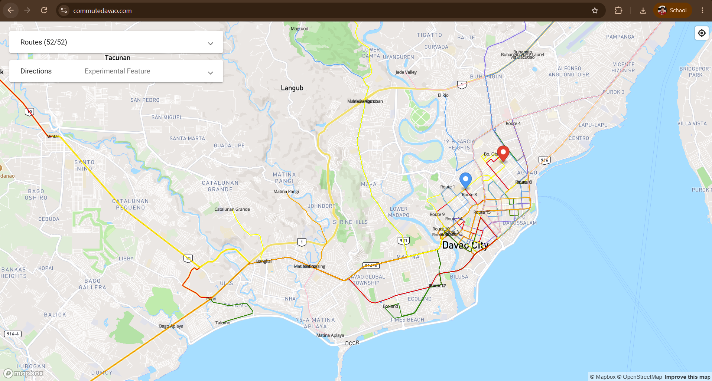

# Software in the Wild: Improving the Diyandi Experience Through Software

> **Name:** Sam Gabriel Benedict A. Laguda 
> **Section:** CS3B
> **Date submitted:** [2026-09-29]

---

## 1. User group

**Who are you designing for?**  
Tourists

**Why might this group need support during Diyandi?**  

Tourists are a group of people with little to no knowledge of Iligan. As they're tourists, they lack the first-hand experience of what everyday life feels like in the city. So the tourists want to know the  recommended spots, restaurants, and events to go to during the Diyandi Festival, all hile attempting to get an authentic feel of the city.

---

## 2. Situation or need

**What is this group trying to do during Diyandi?**  

The tourists want to navigate a new city during its most liveliest time of the year. Knowing the calendar of events for the festival and also exploring local dining, accomodations, and city transportation can better their experience while they're in the city.

---

## 3. Problem or inconvenience

**What may make this task difficult, confusing, unsafe, slow, or inconvenient?**  

When commuting, there is no explicit map of where each jeep or bus goes. For tourists, especially during the busy Diyandi Festival season, there might be road closures and unfamiliar landmark-based fare systems make finding the right public transportation confusing and slow. This also increases the risk of getting lost or paying incorrect fares.

---

## 4. Proposed digital solution

**What digital tool would you propose?**  
A web application and mobile app.

**How would it help the intended users?**  
This app would address the transit map problem by providing an interactive digital route map of Iligan's public transport network. The app also integrates real-time festival road closures and event-driven route diversions so tourists can easily see which jeep route to take when commuting. While particularly useful during the Diyandi Festival, the app functions all throughout the year.
---

## 5. Things users can do

Describe **two specific actions** that users could perform using your proposed system.

1. Searching transit routes by destination, they might enter their desired destination and the app will show all related routes that go through that area. This also shows the fare and a live map of the journey.
2. View an interactive calendar of events map that overlays ongoing events with temporary road closures and detour routes.

---

## 6. Important qualities

Identify **two qualities** that would make your proposed system useful. You may consider whether it should be easy to use, fast, reliable, safe, private, accessible, multilingual, low-data, clear, or available during high demand.

### Quality 1: Low-data consumption

**Why does this matter to users?**  
This is especially important for tourists since they are always on the go. Considering the data consumption of most apps nowadays, the app must consume as minimal of data as possible to ensure the tourists' cellular connectivity won't be affected. Offline caching is also implemented so tourists won't need to turn on their mobile data all the time.

### Quality 2: Accessible UI

**Why does this matter to users?**  
Regardless of age, tourists lack familiarity with local landmarks and transit routes. The app must have an age-friendly interface with colored routes, photo reference points, and step-by-step directions that also accomodates various age groups.

---

## 7. How to tell whether the solution helped

How could you determine whether your proposed solution actually helped users?

Implementing a micro-survey after the festival asking users to rate how easily they were able to navigate throughout the city during the festival ensures any criticisms or suggestions are heard. Also, monitoring the total number of route lookups to confirm active usage during peak event hours.

---

## 8. Screenshot or reference

You may include **one screenshot** or reference image only if it does not contain personal, confidential, or sensitive information.

> Do not include passwords, private messages, account numbers, grades, addresses, personal information, or other confidential content.

<!-- Example Markdown image syntax:

-->

**External sources used, if any:**  
commutedavao.com

---

## AI use declaration

Select **one** option below and complete the applicable details.

- [ ] **No AI tools used.** I did not use any generative AI tool in preparing this submission.

- [x] **AI tools used.** I used the following AI tool(s): Gemini

  **Purpose of use:**  
  Checking of grammar and clarifying of ideas

  **How I reviewed the output:**  
  I reviewed the generated content by ensuring it is aligned with my vision of the output itself. I edited the proposed software features for local accuracy.

  **Prompt(s) or summary of interaction:**  
  [\[Paste the main prompt(s) used, provide a link to the shared conversation if available, or summarize the interaction clearly enough for the instructor to understand the assistance received.\]](https://gemini.google.com/app/8db80e8c181f3f26)

> I understand that I remain responsible for the accuracy, originality, and quality of this submission. I confirm that I reviewed and revised any AI-generated content and can explain all ideas submitted under my name.

---

## Student declaration

I confirm that this work is based primarily on my own observation, experience, and reasoning. Any external sources or tools used have been acknowledged above.

**Name:** Sam Gabriel Benedict A. Laguda
